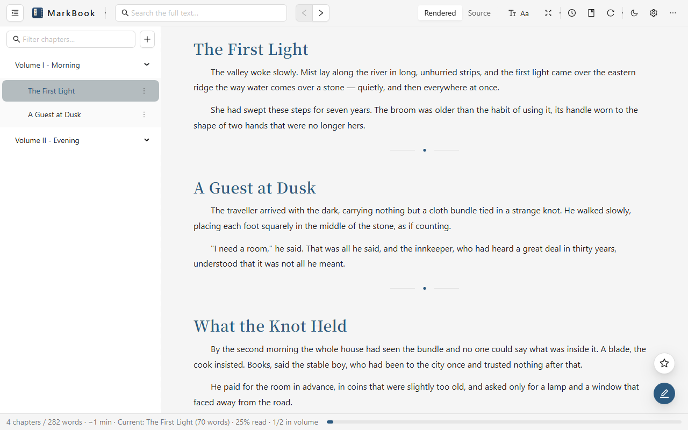

<div align="center">


# MarkBook

**Scattered text, gathered into a book.**

Turn a pile of loose `.md` / `.txt` files into one searchable, editable book — fully local.

[](https://github.com/rockbenben/markbook/actions/workflows/ci.yml) [](LICENSE) [](https://github.com/rockbenben/365opensource)

**[▶ Try it in your browser](https://markbook.newzone.top/)** · [⬇ Run it locally](#run-it-locally) · [简体中文](README.md)

</div>



Do you have a pile of loose text on disk — a few hundred `chapter-NNN.md` files, or a multi-megabyte `.txt` you downloaded? MarkBook turns it into one continuous book to read; when you spot something worth fixing, you edit it in place and it writes back to the file. It isn't trying to replace your editor. It does one thing thoroughly: **make that pile of text comfortable to read.**

Novels, technical manuals, notes, research material — anything you'd rather read as a book.

## Thirty seconds to your first page

1. Open **[markbook.newzone.top](https://markbook.newzone.top/)**
2. Click "Open folder" and pick the directory holding your novel or notes — or pick one large `.txt`
3. Start reading: contents on the left, `Space` to page, search to jump anywhere

Chrome and Edge can also edit in place, writing straight back to your files. Other browsers are read-only.

> [!TIP]
> Everything happens in your own browser and on your own machine: no upload, no account, no network. Reading a local folder from the web version uses the browser's own File System Access API — your files never leave the computer.

## Supported

| Aspect | Support |
|---|---|
| UI languages | Simplified Chinese, Traditional Chinese, English (follows the browser; pinnable in Settings) |
| File formats | `.md` (YAML frontmatter included), `.txt` |
| What you open | A folder (subfolder = volume, file = chapter), or one large file (split by headings) |
| Chapter headings | `#` / `##`, `Chapter X`, `第X章`, `1.1`, Setext underlines… ([full rules](docs/FORMATS.md)) |
| Editing in place | Chrome / Edge (File System Access); other browsers read-only |
| Export | TXT / Markdown / HTML / EPUB; PDF via the browser's print dialog |

## What it does

- **📚 Gather / split** — loose files become one continuous scroll; a large file is split into chapters by heading
- **🎨 Comfortable reading** — size, leading, page width and indent all adjustable, sepia / parchment / night backgrounds, smooth at thousands of chapters
- **🧭 Findable** — contents grouped by volume and following your scroll; full-text search with CJK segmentation and hit highlighting
- **✏️ Fix as you read** — edit in place, replace across chapters to rename a character, clean garbled lines from downloaded text in one click
- **📤 Take it with you** — export whole or by volume, straight into Kindle or a phone reader

Feature-by-feature detail in the [usage guide](docs/USAGE.md).

## Run it locally

The web version is enough day to day. Run the server version when you want it resident on your machine, with external file changes syncing live:

```bash
npm install && npm run build
CV_ROOT=/path/to/library npm start    # single process, opens your browser
# Windows PowerShell: $env:CV_ROOT='D:\novels'; npm start
```

| Aspect | Server version | Web version (static) |
|---|---|---|
| Where files come from | Local filesystem | The folder you pick in your browser |
| External changes sync live | ✅ | Manual "Refresh" |
| Installable / offline (PWA) | — | ✅ |
| Best for | Living on your own machine | Opening a page and going |

Self-hosting, access tokens and directory sandboxing are covered in the [deployment guide](docs/DEPLOY.md).

## FAQ

<details>
<summary>I edited a source file in another editor and nothing changed</summary>

The server version pushes updates via a file watcher. If nothing happens, check that the file is under the current root and is `.md` / `.txt`, and that it isn't excluded by the ignore rules (hidden files, `node_modules` and `.git` are excluded by default). Failing that, hit "Refresh" in the toolbar for a full reload.

</details>

<details>
<summary>Why does the light/dark toggle sometimes do nothing?</summary>

The light/dark switch only applies on the "Default" reading background. Pick Sepia, Parchment or Night and the mode is fixed by that background, greying the toggle out. Set the background back to Default to switch freely again.

</details>

<details>
<summary>How do I export EPUB or PDF?</summary>

EPUB is generated by the server version, ready to use as downloaded. There is no separate PDF export: choosing PDF opens a typeset HTML page and calls the browser's print dialog, where you pick "Save as PDF".

</details>

## Limitations

- Editing in place needs File System Access — Firefox and Safari get a read-only web version
- EPUB export is server-version only; on the web, use HTML or print to PDF
- CJK search segmentation needs a recent environment: a current browser, or Node 20.19+ on the server

## Documentation

| Document | Contents |
|---|---|
| [Usage](docs/USAGE.md) | Reading, editing, search, export, settings |
| [Deployment](docs/DEPLOY.md) | Server vs web version, securing a public deployment, PWA |
| [Configuration](docs/CONFIGURATION.md) | Where settings live, environment variables, sorting and ignore rules |
| [Formats](docs/FORMATS.md) | Heading / volume / chapter / numbering detection, natural sort |

## Contributing

Issues and pull requests welcome. Node 20.19+, `npm install` → `npm run dev` to get running, `npm test` and both type checks before you push, [Conventional Commits](https://www.conventionalcommits.org/) for messages.

<details>
<summary>Dev troubleshooting: stuck on "Loading" or a blank screen</summary>

In dev mode the frontend (Vite, 5173) proxies `/api` and `/ws` to the backend at `http://127.0.0.1:5179` — a hardcoded IP, to sidestep `localhost` resolving to IPv6 on some systems. Check the backend is running and listening on `127.0.0.1:5179`, and that you opened the Vite address. When running the build, go straight to `http://127.0.0.1:5179`; it binds to loopback only, and `CV_PORT` changes the port.

</details>

## About the 365 Open Source Plan

Project **#011** of the [365 Open Source Plan](https://github.com/rockbenben/365opensource) — one person + AI, 300+ open-source projects in a year.

[Submit your idea →](https://365.aishort.top/) · [Discord](https://discord.gg/PZTQfJ4GjX) · [Telegram](https://t.me/aishort_top)
