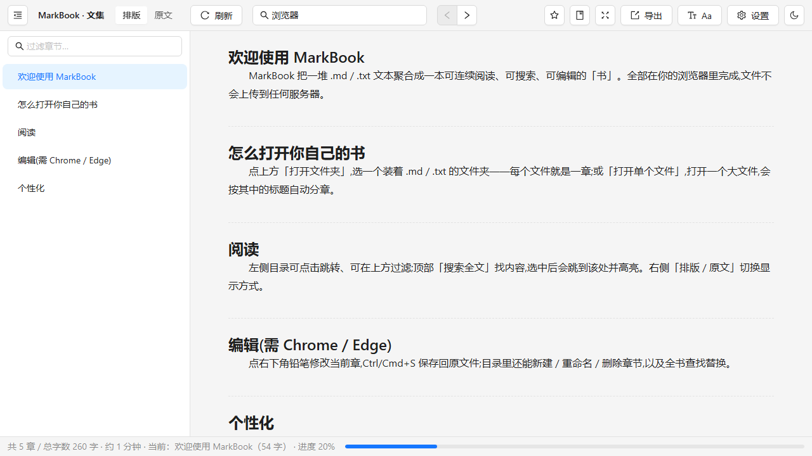

<div align="center">


# MarkBook · 文集

**散落文本，聚合成书。**

散落文本聚合阅读器 —— 纯本地、零上传

[](https://github.com/rockbenben/markbook/actions/workflows/ci.yml)
[](https://markbook.newzone.top/)
[](LICENSE)
[](https://github.com/rockbenben/365opensource)

</div>

[English](README.en.md) · **简体中文**

把一个文件夹(含子目录)里散落的 `.md` / `.txt`,**或一个大文件**,自动聚合 / 拆分成一本连续、可导航、可搜索、可导出的书 —— 读为先,读到需要时顺手就地编辑与整理。纯本地、零上传,文件改动实时同步。

你电脑里是不是有一坨散落的文本——几百个 `第NNN章.md`、一个几兆的下载网文 `.txt`、或一文件夹杂乱笔记?MarkBook 把它们(或一个大文件)自动**拆分 / 聚合成一本连续的书**:识别章节与卷、自然排序、全文搜索、按卷导出 TXT / EPUB / HTML,读起来像翻一本电子书。读到错别字想顺手改、要统一称谓、或清理下载来的乱码脏文本?**就地编辑、全局替换、一键整理**,改完写回原文件。它不跟专业编辑器抢饭碗,只把一件事做透:**让你那堆文本变得能舒服地读。**

🚀 **在线体验:[markbook.newzone.top](https://markbook.newzone.top/)** —— 在你自己的浏览器里打开本地文件夹,零上传。

> 适合长篇小说 / 下载网文、技术文档、研究资料、笔记日志——任何由许多段文本组成、想当成一本书来读的东西。



## 目录

- [MarkBook · 文集](#markbook--文集)
  - [目录](#目录)
  - [功能特性](#功能特性)
  - [适用场景](#适用场景)
  - [快速开始](#快速开始)
  - [两种部署方式](#两种部署方式)
  - [两种内容模式](#两种内容模式)
  - [文档](#文档)
  - [技术栈](#技术栈)
  - [常见问题](#常见问题)
  - [隐私](#隐私)
  - [贡献](#贡献)
  - [关于 365 开源计划](#关于-365-开源计划)

## 功能特性

MarkBook 把一堆散落的文本——几百个 `第001章.md`、一份下载来的网文 `.txt`、或一文件夹杂乱笔记——当作**一本书**来读;需要时再顺手改:

- **📚 聚合 / 拆分** —— 目录下所有 `.md` / `.txt` 按自然顺序拼成一页连续滚动文档;打开单个大文件时按标题(`#` / `##`、`第X章`、`一、`、`1.1`、Setext 下划线……)自动切章。`.md` 支持 YAML frontmatter(`title` 作标题、`tags` 显示为标签);`.txt` 里中文章节语义(篇 / 卷 > 章 / 节)优先于排版装饰,`#`、`===`、分隔条当装饰处理。
- **🎨 阅读体验** —— 虚拟化渲染(几百上千章也流畅,超大单章自动分页)、排版 / 原文视图(`.txt` 也按正文排版、代码块语法高亮、本地相对图片可显示且不溢出)、字号 / 行距 / 字体 / 页宽 / 首行缩进、护眼 / 羊皮纸 / 夜间背景、沉浸模式、阅读进度与书签,响应式窄屏自适应,全部持久化。
- **🧭 导航** —— 左侧自动生成、按卷分组、可折叠可过滤的目录(TOC),滚动时高亮并跟随当前章;长文档另有浮动**章内大纲**(子标题导航);md **跨文件链接**(`[x](./other.md)`)点击跳到对应章;`j` / `k`、空格翻页、`Home` / `End` 快捷键;目录模式可在 TOC 中**手动拖动排序**(卷内拖动,顺序存浏览器,导出同步跟随)。
- **🔍 搜索** —— FlexSearch 索引 + `Intl.Segmenter` 中文分词,多词 / 前缀 / 相关度排序,显示每章命中数,跳转后高亮命中。
- **📤 导出** —— 整本或按卷导出 TXT / Markdown / HTML(自带目录与样式)/ EPUB,送进 Kindle / 手机阅读器或分享。PDF 走浏览器打印生成的 HTML;EPUB 需服务端版。
- **✏️ 顺手编辑 / 整理** —— 读到错别字就地改、跨章全局查找替换(统一称谓)、一键**整理**(去乱码 / 重复行 / 分隔条 / 全角转半角…清理下载来的脏文本,可预览)、章节新建 / 改名 / 删除;CodeMirror 双栏预览、防抖自动保存、mtime 冲突保护,改完写回原文件。**够用就好,不跟专业编辑器抢活。**
- **⚡ 实时同步** —— chokidar 监听 + WebSocket 推送,外部改动文件后视图平滑更新并保留滚动位置(服务端版)。
- **🌍 界面语言** —— 简体中文 / English,设置里随时切换,默认跟随浏览器语言。

> 一切在本机运行,数据不出本地。逐项说明见 [使用指南](docs/USAGE.md)。

## 适用场景

最初是为**写长篇小说 / 网文**而做的:几百个 `第NNN章.md` 散在一个文件夹里,用它**聚合成一本连续稿**通读、就地改稿、跨章查找替换、按卷导出。除此之外,凡是「**很多段文本想当成一本书来读 / 改**」的场景都适用:

- **✍️ 小说 / 网文创作 / 阅读** —— 多章聚合连读,把控节奏与前后照应;就地改稿、全书查找替换(改名、统一称谓)、一键**整理**从小说站下载的杂乱文本、按卷导出。
- **📚 技术文档 / 手册** —— 把分散的 `.md` 聚合阅读,或把一份大手册按标题自动拆章导航;改完即存回源文件。
- **🗒️ 笔记 / 研究资料** —— 按日期或主题分的文件、零散摘录,聚合成一本可全文检索的册子,随手编辑。
- **📖 电子书制作** —— 聚合后一键导出 TXT / Markdown / HTML / EPUB,送进 Kindle 或手机阅读器。

翻译校对、剧本讲稿、接手别人的一堆文本,同理。

> 不依赖特定目录结构或命名规范——文件名带编号(如 `第001章`)排序最准,没有也能用标题 / 文件名兜底。

## 快速开始

```bash
npm install

# 开发(前端 5173 + 后端 5179,自动代理,改动热更新)
npm run dev

# 指定要读的库(目录或单个文件):
CV_ROOT=/path/to/library npm run dev
# Windows PowerShell:  $env:CV_ROOT='D:\我的小说'; npm run dev
```

生产 / 日常使用:

```bash
npm run build
CV_ROOT=/path/to/library npm start   # 单进程启动并自动打开浏览器
```

也可以把库路径作为参数:

```bash
node dist/server/index.js "D:\我的小说\全本.md"
```

你在界面里选过的根目录、排序、阅读偏好等都记在**浏览器本地**(localStorage),刷新 / 重启后由浏览器自动恢复(见 [配置](docs/CONFIGURATION.md));服务端本身不再写配置文件。`CV_ROOT` / 命令行参数用作启动默认库。

## 两种部署方式

|                    | 服务端版                           | 纯静态网页版                                                   |
| ------------------ | ---------------------------------- | -------------------------------------------------------------- |
| 怎么跑             | `npm run build && npm start`(Node) | `npm run build:static` → 把 `dist/static` 托管到任意静态服务器 |
| 文件从哪来         | 服务端文件系统                     | 访客**自己浏览器**里选自己的文件夹 / 文件                      |
| 实时监听外部改动   | ✅                                 | ❌(手动「刷新」重读)                                           |
| 可安装 / 离线(PWA) | —                                  | ✅                                                             |
| 适合               | 自己机器上当本地工具               | 放网页上人人直接用、零上传                                     |

静态版可读 / 搜 / 改 / 导出,设置全存浏览器;Chrome / Edge 用 File System Access 可就地编辑,其它浏览器只读。详见 **[部署 DEPLOY](docs/DEPLOY.md)**。

> 本仓库已内置 GitHub Actions(`.github/workflows/ci.yml`):每次推送到默认分支会自动跑类型检查 + 测试 + 构建,并把静态版发布到 **`gh-pages`** 分支。首次启用:仓库 **Settings → Pages → Source** 选 `gh-pages` 分支即可上线。

## 两种内容模式

| 打开的对象   | 模式       | 章节来自                                                |
| ------------ | ---------- | ------------------------------------------------------- |
| **一个目录** | 目录模式   | 每个 `.md` / `.txt` 文件 = 一章;子目录 = 卷             |
| **一个文件** | 单文件模式 | 按文件内的标题切分成章节;`#`=卷、`##`=章 等层级自动识别 |

两种模式下阅读、搜索、编辑、导出体验一致。识别的标题 / 编号格式见 [支持的格式](docs/FORMATS.md)。

## 文档

| 文档                                        | 内容                                                                  |
| ------------------------------------------- | --------------------------------------------------------------------- |
| [使用指南 USAGE](docs/USAGE.md)             | 阅读、编辑、搜索、导出、设置逐项说明                                  |
| [部署 DEPLOY](docs/DEPLOY.md)               | 服务端版 vs 纯静态版、对外部署安全(令牌 / 沙箱)、PWA                  |
| [配置 CONFIGURATION](docs/CONFIGURATION.md) | 设置存哪(浏览器 localStorage)、环境变量、根目录优先级、排序与忽略规则 |
| [支持的格式 FORMATS](docs/FORMATS.md)       | 目录 vs 单文件、标题 / 卷 / 章 / 编号识别规则、自然排序               |

## 技术栈

- **前端** —— Vite 8(Rolldown)+ React 19 + TypeScript + antd 6 + zustand;阅读 react-markdown(remark-gfm、rehype-highlight 代码高亮、github-slugger 锚点)、frontmatter 解析 yaml,编辑 CodeMirror 6(按需懒加载),列表 react-virtuoso;测试 Vitest 4。
- **后端** —— Fastify 5 + chokidar + WebSocket,搜索 FlexSearch,导出 unified / epub-gen-memory,生产经 esbuild 打包为单文件服务。
- **共享核心** —— 与运行环境无关的逻辑(解析 / 拆分 / 排序 / 搜索 / 导出 / 整理 / 链接 / 渲染预处理 / id)集中在 `core/`,服务端与浏览器端共用,**一处实现两端同步**。静态版(`npm run build:static`,vite-plugin-pwa)正是用它把同一套逻辑搬进浏览器,经 File System Access API + localStorage 实现零服务端运行。

纯本地、零上传。

## 常见问题

<details>
<summary>首屏一直「加载中」,或换库后白屏 / 加载失败</summary>

开发模式下前端(Vite,5173)经代理把 `/api`、`/ws` 转发到后端,代理目标写死为 `http://127.0.0.1:5179`(而非 `localhost`,以回避某些系统把 `localhost` 解析到 IPv6 `::1` 导致连不上的问题)。请确认:① 后端确实在跑且监听 `127.0.0.1:5179`;② 浏览器开的是 Vite 地址(默认 `http://localhost:5173`)。跑构建产物时(`npm start`),前后端同进程,服务监听 `127.0.0.1:5179`,直接访问 `http://127.0.0.1:5179` 即可——它**只绑定本地回环**,不对外暴露。端口可用 `CV_PORT` 改。

</details>

<details>
<summary>单文件模式拆章 / 中文搜索分词异常,或启动报 <code>Intl.Segmenter</code> 相关错误</summary>

全文搜索的中文分词用到 `Intl.Segmenter`,需要较新的 Node(项目本身要求 Node 20.19+,推荐 22 / 24)。Node 过旧可能缺该 API,请升级 Node 后重试。

</details>

<details>
<summary>用别的编辑器改了源文件,界面没更新</summary>

MarkBook 用 chokidar 监听文件、经 WebSocket 推送更新。若没生效:① 确认改的文件在当前根目录下、且是 `.md` / `.txt`;② 确认它没被 `ignore` 规则排除(默认排除隐藏文件、`node_modules`、`.git`,可在 [配置](docs/CONFIGURATION.md) 调整);③ 应用自身写盘后有一个短时「自写守卫」窗口会忽略自己触发的事件,属正常。实在不行,工具栏「刷新」做一次手动全量重载。

</details>

<details>
<summary>导出 EPUB / PDF</summary>

EPUB 由服务端直接生成,下载即用(可放进 Kindle / 手机阅读器)。**PDF 没有独立导出**:选 PDF 时会打开一份排版好的 HTML 并调用**浏览器打印**,在打印对话框里选「另存为 PDF」即可。EPUB 仅服务端版提供,网页版可改用 HTML / PDF。

</details>

<details>
<summary>明暗主题为什么有时切不动?(与阅读背景的关系)</summary>

工具栏的「明暗主题」开关与「阅读背景」(阅读设置 Aa 里的 默认 / 护眼 / 羊皮纸 / 夜间)是联动的:

| 阅读背景   | 明暗                          | 主题开关         |
| ---------- | ----------------------------- | ---------------- |
| **默认**   | 跟随主题开关(可手动切明 / 暗) | **可用**         |
| 护眼(米黄) | 亮                            | 禁用(由背景决定) |
| 羊皮纸     | 亮                            | 禁用(由背景决定) |
| 夜间       | 暗                            | 禁用(由背景决定) |

也就是说:**只有「默认」背景下才能手动切明 / 暗**;一旦选了护眼 / 羊皮纸 / 夜间,明暗由该背景固定,主题开关变灰。想自由切明暗,先把背景设回「默认」。

</details>

## 隐私

MarkBook 只读写你指定的本地目录 / 文件,不连任何外部服务,不上传任何内容。**设置与最近来源都存在浏览器本地**(localStorage / IndexedDB),服务端不写共享配置文件。服务端版默认只绑定本地回环(`127.0.0.1`);若需对外提供(`CV_HOST`),请配合 `CV_TOKEN`(鉴权)与 `CV_BASE`(目录沙箱),详见 [CONFIGURATION](docs/CONFIGURATION.md)。静态版完全在访客浏览器内运行,文件不出本地。

## 贡献

欢迎 Issue 与 Pull Request。

- 环境:Node 20.19+(推荐 22 / 24;Vite 8 的最低要求,中文分词另依赖 `Intl.Segmenter`)。
- 本地跑通:`npm install` → `npm run dev`(前端 5173 + 后端 5179,自动代理、热更新)。完整脚本见 `package.json`。
- 提交前:`npm test` 与两个 `tsc --noEmit` 类型检查应通过(CI 会再跑一遍)。
- 提交信息用 [Conventional Commits](https://www.conventionalcommits.org/) 风格(`feat:` / `fix:` / `docs:` …)。
- 改了行为请同步更新相关文档。

## 关于 365 开源计划

[365 开源计划](https://github.com/rockbenben/365opensource) 的第 **#011** 个项目——一个人 + AI，一年 300+ 个开源项目。[提交你的需求 →](https://365.aishort.top/) · [Discord](https://discord.gg/PZTQfJ4GjX) · [Telegram](https://t.me/aishort_top)
