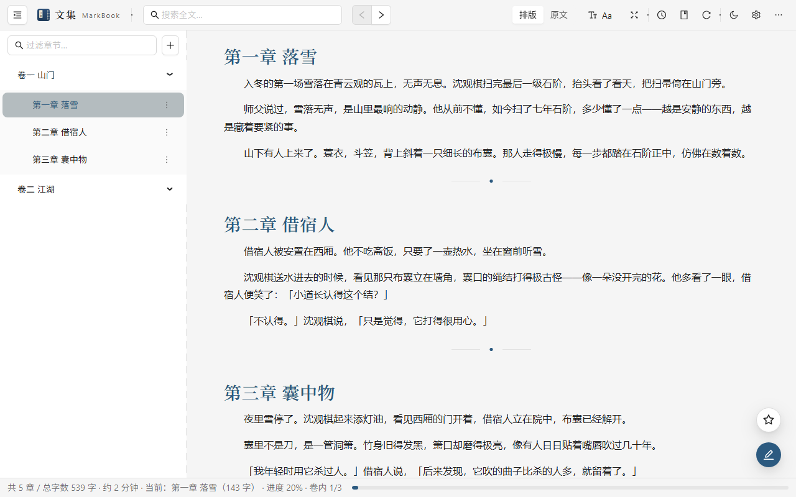

<div align="center">


# MarkBook · 文集

**散落文本，聚合成书。**

把散落的 `.md` / `.txt` 拼成一本能读、能搜、能改的书，纯本地、零上传。

[](https://github.com/rockbenben/markbook/actions/workflows/ci.yml) [](LICENSE) [](https://github.com/rockbenben/365opensource)

**[▶ 在线体验](https://markbook.newzone.top/)** · [⬇ 本地部署](#本地部署) · [English](README.en.md)

</div>



你电脑里是不是有一坨散落的文本——几百个 `第NNN章.md`，或一个几兆的下载网文 `.txt`？MarkBook 把它们变成一本连续的书来读；读到哪里不顺眼，就地改完写回原文件。它不跟专业编辑器抢活，只把一件事做透：**让那堆文本变得能舒服地读。**

网文、技术手册、笔记、研究资料——任何想当成一本书来读的东西都适用。

## 三十秒用上

1. 打开 **[markbook.newzone.top](https://markbook.newzone.top/)**
2. 点「打开文件夹」，选你放小说或笔记的目录——或直接选一个大 `.txt`
3. 开始读：左侧是自动生成的目录，`空格` 翻页，搜索框直达任何一句

Chrome / Edge 里还能就地编辑，改动直接写回你的文件；其它浏览器只读。

> [!TIP]
> 一切都在你自己的浏览器和机器里完成：不上传、不联网、不注册。网页版读本地文件夹用的是浏览器自带的 File System Access，文件不出电脑。

## 支持范围

| 方面 | 支持 |
|---|---|
| 界面语言 | 简体中文 / 繁体中文 / English（自动跟随浏览器，设置里可钉死） |
| 文件格式 | `.md`（含 YAML frontmatter）、`.txt` |
| 打开对象 | 一个文件夹（子目录 = 卷、文件 = 章），或一个大文件（按标题自动切章） |
| 章节标题 | `#` / `##`、`第X章`、`一、`、`1.1`、Setext 下划线……（[完整规则](docs/FORMATS.md)） |
| 就地编辑 | Chrome / Edge（File System Access）；其它浏览器只读 |
| 导出 | TXT / Markdown / HTML / EPUB；PDF 走浏览器打印 |

## 能做什么

- **📚 聚合 / 拆分** —— 散文件拼成一页连续长文，大文件按标题自动切章
- **🎨 舒服地读** —— 字号 / 行距 / 页宽 / 缩进随手调，护眼 / 羊皮纸 / 夜间背景，几千章也流畅
- **🧭 找得到** —— 目录按卷分组、跟随滚动；全文搜索带中文分词，跳转后高亮命中
- **✏️ 顺手改** —— 就地编辑、跨章查找替换统一称谓、一键清理下载文本的乱码与重复行
- **📤 带得走** —— 整本或按卷导出，送进 Kindle 或手机阅读器

逐项说明见 [使用指南](docs/USAGE.md)。

## 本地部署

网页版够日常用。想让它常驻本机、外部改动实时同步，跑服务端版：

```bash
npm install && npm run build
CV_ROOT=/path/to/library npm start    # 单进程启动，自动打开浏览器
# Windows PowerShell：$env:CV_ROOT='D:\我的小说'; npm start
```

| 方面 | 服务端版 | 网页版（纯静态） |
|---|---|---|
| 文件从哪来 | 本机文件系统 | 你浏览器里选的文件夹 |
| 外部改动实时同步 | ✅ | 手动「刷新」重读 |
| 可安装 / 离线（PWA） | — | ✅ |
| 适合 | 自己机器上常驻 | 打开网页就用 |

部署到自己服务器、令牌与目录沙箱见 [部署指南](docs/DEPLOY.md)。

## 常见问题

<details>
<summary>用别的编辑器改了源文件，界面没更新</summary>

服务端版靠文件监听推送更新。没生效时依次确认：改的文件在当前根目录下且是 `.md` / `.txt`；没被忽略规则排除（默认排除隐藏文件、`node_modules`、`.git`）。实在不行，点工具栏「刷新」全量重读。

</details>

<details>
<summary>明暗主题为什么有时切不动</summary>

明暗开关只在「默认」阅读背景下可用；选了护眼 / 羊皮纸 / 夜间后，明暗由背景固定，开关变灰。想自由切换，先把背景设回「默认」。

</details>

<details>
<summary>EPUB / PDF 怎么导出</summary>

EPUB 由服务端版直接生成，下载即用。PDF 没有独立导出：选 PDF 会打开一份排版好的 HTML 并调起浏览器打印，在对话框里选「另存为 PDF」。

</details>

## 限制

- 就地编辑依赖 File System Access，Firefox / Safari 打开网页版只读
- EPUB 导出仅服务端版有；网页版请用 HTML，或走浏览器打印出 PDF
- 搜索的中文分词需要较新环境：网页版要新版浏览器，服务端版要 Node 20.19+

## 文档

| 文档 | 内容 |
|---|---|
| [使用指南](docs/USAGE.md) | 阅读、编辑、搜索、导出、设置逐项说明 |
| [部署](docs/DEPLOY.md) | 服务端版 vs 网页版、对外部署安全、PWA |
| [配置](docs/CONFIGURATION.md) | 设置存哪、环境变量、排序与忽略规则 |
| [支持的格式](docs/FORMATS.md) | 标题 / 卷 / 章 / 编号识别规则、自然排序 |

## 贡献

欢迎 Issue 与 Pull Request。环境 Node 20.19+，`npm install` → `npm run dev` 跑通，提交前过 `npm test` 与类型检查，提交信息用 Conventional Commits 风格。

<details>
<summary>开发模式排障：首屏一直「加载中」或白屏</summary>

开发模式下前端（Vite，5173）把 `/api`、`/ws` 代理到后端 `http://127.0.0.1:5179`（写死 IP 以回避 `localhost` 被解析到 IPv6 的问题）。确认后端在跑且监听 `127.0.0.1:5179`，浏览器开的是 Vite 地址。跑构建产物时直接访问 `http://127.0.0.1:5179`，只绑定本地回环，端口用 `CV_PORT` 改。

</details>

## 关于 365 开源计划

[365 开源计划](https://github.com/rockbenben/365opensource) 的第 **#011** 个项目——一个人 + AI，一年 300+ 个开源项目。

[提交你的需求 →](https://365.aishort.top/) · [Discord](https://discord.gg/PZTQfJ4GjX) · [Telegram](https://t.me/aishort_top)
